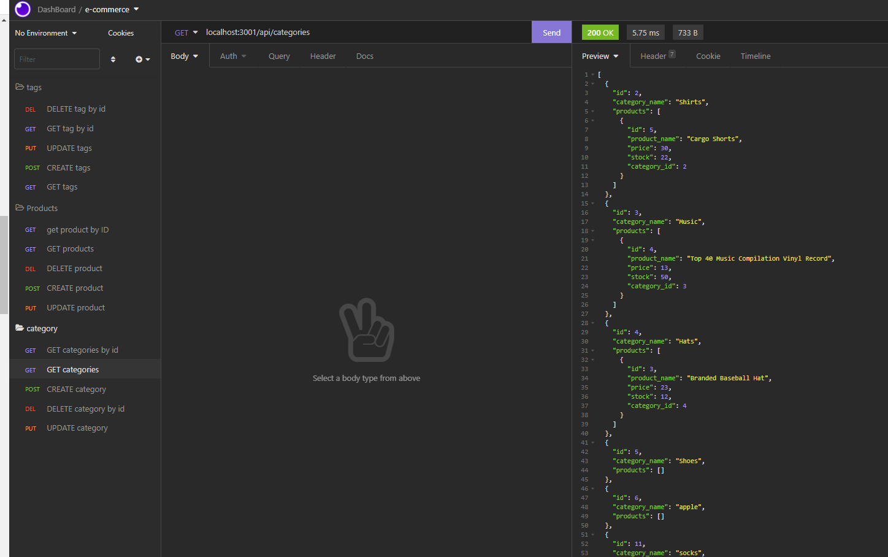
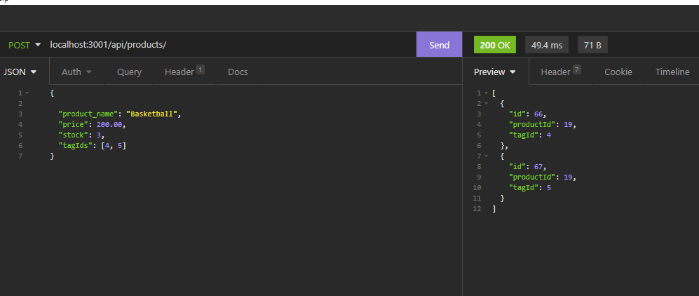
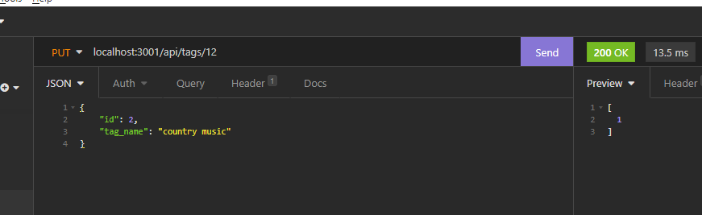
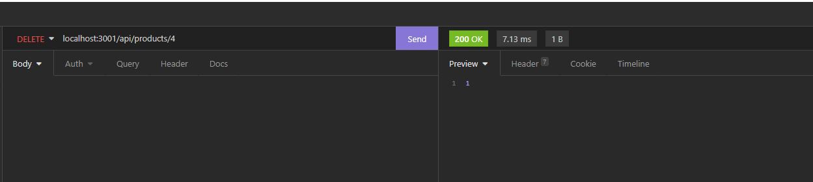

# E-Commerce

### Siddharth Desai
## Description
The purpose of this project was to complete a e-commerce sites backend processing using Express.js API, Sequelize, dotenv and Insomnia. The user is able to perform GET,POST,PUT and DELETE operation for categories, products and tags for their e-commerce company. The project increase my knowledge in handling CRUD operation as well as understanding how to work with express.js. Lastly, I learned how to test and valiate request using Insomnia 


## User Story

```md
AS A manager at an internet retail company
I WANT a back end for my e-commerce website that uses the latest technologies
SO THAT my company can compete with other e-commerce companies
```

## Acceptance Criteria

```md
GIVEN a functional Express.js API
WHEN I add my database name, MySQL username, and MySQL password to an environment variable file
THEN I am able to connect to a database using Sequelize
WHEN I enter schema and seed commands
THEN a development database is created and is seeded with test data
WHEN I enter the command to invoke the application
THEN my server is started and the Sequelize models are synced to the MySQL database
WHEN I open API GET routes in Insomnia Core for categories, products, or tags
THEN the data for each of these routes is displayed in a formatted JSON
WHEN I test API POST, PUT, and DELETE routes in Insomnia Core
THEN I am able to successfully create, update, and delete data in my database
```

[](https://opensource.org/licenses/BSD-2-Clause)
## Table of Contents
1. [ Description. ](#description)
2. [ Installation. ](#installation)
3. [ Usage. ](#usage)
4. [ License. ](#license)
6. [ Tests. ](#tests)
7. [ Questions. ](#questions)
8. [ Video. ](#video)
9. [ Screenshots. ](#screenshots)
10. [ Links. ](#links)
11. [ Resources. ](#resources)
## Installation
* Clone the repository using:
```
git clone git@github.com:SHD118/Employee-Tracker.git
```
* Ensure you are in the current working directory
* Ensure all dependencies are installed as shown below installation instructions are below:
```
{
  "dependencies": {
    "dotenv": "^8.2.0",
    "express": "^4.17.1",
    "mysql2": "^2.1.0",
    "sequelize": "^5.21.7"
  }
}

```
Run the below commands to install any missing dependencies
```
npm init
```
```
npm install sequelize
```
```
npm install mysql2
```
```
npm install dotenv
```

## Usage
* Ensure all depencies and above steps are fulfilled 
* Navigate to the working directory and open a terminal and run the below command
```
mysql -u root -p
```
* After enter password run the below command to initiliaze the database
```
SOURCE schema.sql || SOURCE seeds.sql
```
* Lastly run the seed to initialize the the database data and start the application with the following commands:
```
npm run seed
npm run watch
```

## License
Free Use
## Tests
N/A
## Questions?
Want to see more of my work? [Github Link](https://github.com/SHD118/Team-Profile)
<br/>
Want to learn more please contact me at shdesai118@gmail.com

## Video
https://www.awesomescreenshot.com/video/7558642

## Screenshots





## Links
https://github.com/SHD118/E-Commerce


## Resources

